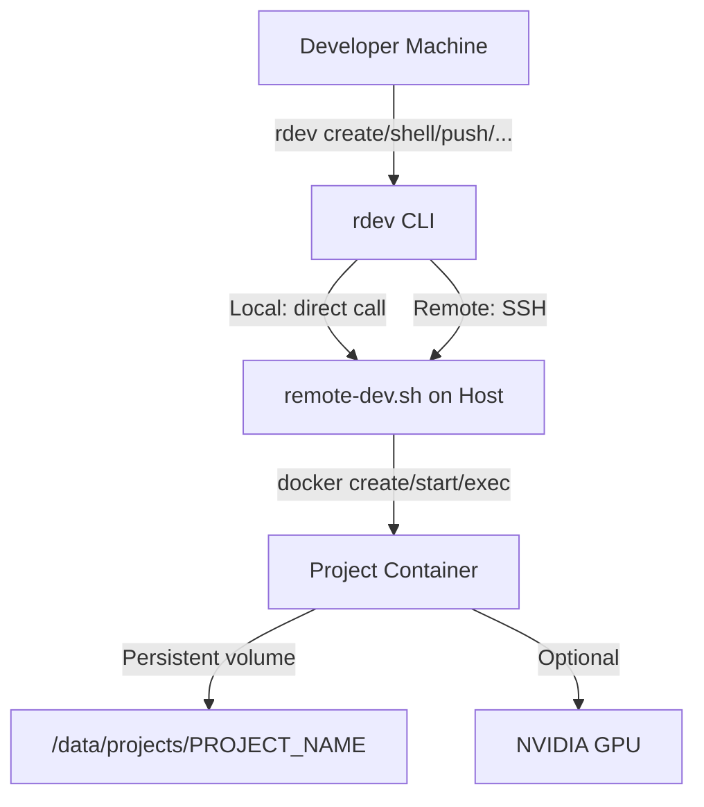

# Remote Dev

A system to let developers and LLMs work on Python projects inside remote Linux containers on a shared machine with CUDA GPU (H100). Named projects replace raw Docker containers — each project gets its own isolated environment with persistent storage, Python, git, and optional GPU access.

## Architecture



| Concept | Description |
|---------|-------------|
| **Project** | A named unit of work = 1 Docker container + 1 persistent volume |
| **remote-dev.sh** | Server-side script that manages containers (create, start, stop, shell, list, destroy, etc.) |
| **rdev** | Local CLI wrapper — calls `remote-dev.sh` directly (local) or via SSH (remote) |
| **Project Volume** | Bind mount on host → `/workspace` inside container |

## Main Capabilities

- **Named projects** instead of raw containers — developers work on `my-app`, not `docker run ...`
- **Persistent storage** — files survive container restarts
- **Create from scratch** or **clone from a git URL**
- **Template injection** — new projects get `AGENT.md` (LLM instructions) and `README.md` automatically
- **GPU passthrough** — optional `--gpu` flag for CUDA workloads
- **Push/pull files** between host and container
- **Local or remote mode** — test locally, deploy to server via SSH

## Quick Start

```bash
# Build the base image (one-time)
./rdev build

# Create a new project
./rdev create my-app

# Create a project from an existing repo
./rdev create ml-training --git-url https://github.com/user/repo.git --gpu

# Open a shell inside the project
./rdev shell my-app

# Run a command
./rdev exec my-app python3 train.py

# List all projects
./rdev list

# Stop / start a project
./rdev stop my-app
./rdev start my-app

# Push/pull files
./rdev push my-app ./local_file.py
./rdev pull my-app /workspace/results.csv ./

# Destroy a project (container + data)
./rdev destroy my-app
```

## Commands

| Command | Description |
|---------|-------------|
| `create <name> [--gpu] [--git-url <url>]` | Create a new project container |
| `destroy <name> [--yes]` | Remove project container and data |
| `start <name>` | Start a stopped project |
| `stop <name>` | Stop a running project |
| `shell <name>` | Open interactive shell |
| `exec <name> <cmd...>` | Run a command in the project |
| `list` | List all projects with status |
| `status <name>` | Show detailed project info |
| `logs <name>` | Show container logs |
| `push <name> <local-path>` | Copy files into project |
| `pull <name> <remote-path> [dest]` | Copy files from project |
| `build` | Build the base Docker image |

## Project Structure

```
remote-dev/
├── README.md                # This file
├── remote-dev.sh            # Server-side management script
├── rdev                     # Local developer CLI
├── .env.example             # Configuration template
├── docker/
│   ├── Dockerfile           # Base container image (Ubuntu 22.04 + Python + git)
│   └── entrypoint.sh        # Container entrypoint
├── templates/
│   ├── AGENT.md             # LLM agent instructions (injected into projects)
│   └── README.md            # New project README template
├── test/
│   └── run_tests.sh         # Integration test suite
└── data/projects/           # Persistent project volumes (created at runtime)
```

## Configuration

Copy `.env.example` to `.env` and customize:

```bash
RDEV_DATA_DIR=./data/projects    # Where project volumes live on host
RDEV_IMAGE=rdev-base:latest      # Docker image for containers
RDEV_HOST=local                  # "local" or "user@host" for SSH mode
RDEV_DOCKER=docker               # Docker binary path
```

## Container Environment

Each project container includes:
- **Ubuntu 22.04** (or `nvidia/cuda` for GPU production)
- **Python 3.10+** with pip and venv
- **Git** pre-configured
- **tmux, curl, nano, vim** for development
- **`/workspace`** as the working directory with persistent storage
- **`AGENT.md`** — instructions for LLM agents on how to work inside the container

## Running Tests

```bash
bash test/run_tests.sh
```

Tests the full lifecycle: build → create → templates → exec → persistence → git clone → list → status → push/pull → destroy.

## Deployment to Remote Server

1. Push this repo to GitHub
2. SSH into the server and clone it
3. Copy `.env.example` → `.env`, set `RDEV_DATA_DIR` to an absolute path (e.g. `/data/projects`)
4. Update `docker/Dockerfile` base image to `nvidia/cuda:12.1.0-devel-ubuntu22.04`
5. Run `./remote-dev.sh build` on the server
6. Locally, set `RDEV_HOST=user@server` in `.env` to use SSH mode via `rdev`
